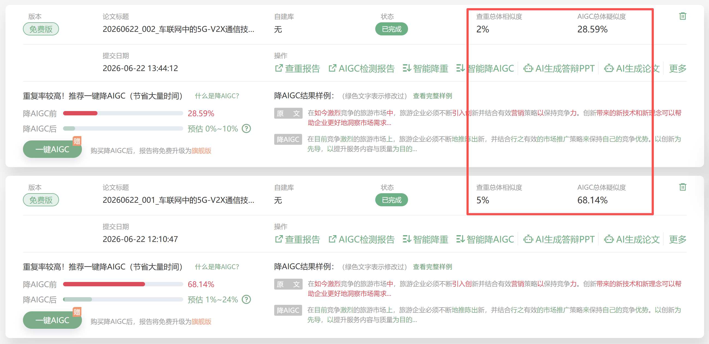

<h1 align="center">💧 水论文.skill</h1>
<h3 align="center">WaterPaper · 一句话出论文</h3>

<p align="center"><em>"优秀太累了，我只想方便、及格、然后交掉。"</em></p>

<p align="center">
  
  
  
</p>

<p align="center">
  <a href="#为什么你需要这个">为什么你需要这个</a> ·
  <a href="#快速开始">快速开始</a> ·
  <a href="#工作流">工作流</a> ·
  <a href="#项目结构">项目结构</a> ·
  <a href="#文献数据源">文献数据源</a> ·
  <a href="#论文结构课程论文">论文结构</a> ·
  <a href="#图表类型">图表类型</a> ·
  <a href="#常见问题">常见问题</a>
</p>

<p align="center">
  一句话出选题 → 自动查找<strong>真实文献</strong> → 调节<strong>标准格式</strong> → 降低<strong>AI率</strong> → 降低<strong>查重率</strong> → 交付 .docx<br/>
  不是真的水——而是把体力活自动化，让你的时间用在更有价值的事情上。
</p>

---

## 为什么你需要这个

期末周，N 篇课程论文压过来。每篇的流程都一样：

> 想题目 → 搜文献 → 看文献 → 写大纲 → 凑字数 → 调格式 → 降低AI率 → 交付

【水论文.skill】把这些事自动化了：

| 环节 | 手工方式 | 【水论文.skill】 |
|------|----------|------------|
| 选题 | 绞尽脑汁想 1 个 | 一句话出 5 角度 × 2 选题 = 10 个 |
| 文献 | 翻 CNKI、万方，复制粘贴 | 多源爬虫自动抓取，去重去假 |
| 格式 | 对着模板一行行调 | 上传 .docx 模板 → 自动提取 → 严格复刻 |
| 图表 | 用 Excel 画、截图、插入 | HTML 渲染科研级 SVG 图表 → 自动插 |
| 降AI | 硬着头皮改套话、调句式 | D0-D7 七维约束 + PaperPass 五模式扫描 + 9 大改写技法 |
| 降重 | 手动改写重复段落 | 深度语义改写 + 表述角度转换 + 引用归并 |

你只需要两件事：**说需求** 和 **做选择**。剩下的交给脚本。

## 和 DeepSeek / 豆包 / ChatGPT 等大模型客户端的区别

用大模型客户端直接写论文有一个致命问题：**它会编造参考文献**。标题、作者、期刊看起来像真的，实际上不存在。

【水论文.skill】的核心设计就是解决这个问题：

```
大模型客户端:    你提需求 → AI 编选题 → AI 编大纲 → AI 编文献 → AI 写
【水论文.skill】:   你提需求 → AI 出选题 → ⚡爬虫抓真实文献 → AI 按文献写 → 交付
```

所有参考文献都来自 CrossRef / Semantic Scholar / 百度学术的实际抓取结果，每条标注来源和可核验状态。不确定真实性的条目直接丢弃，不写"猜测型引用"。

## 快速开始

把本项目的 GitHub 地址或下载到本地的文件夹路径，发给你的 AI 编程助手（Claude Code / Codex / Trae / Cursor 等），然后说：

> "帮我安装这个 skill：https://github.com/ThisIsLittleSky/WaterPaper.git"

AI agent会自动完成配置

装好之后，直接说你的需求：

> "用这个skill帮我写一篇关于移动通讯技术的期末论文，4000 字，格式模板是模板.docx"
>
> “帮我给我的论文降低AI率，【论文路径】、【查重报告.html（可选）】”

AI 会走完整流程：**要模板 → 出选题 → 爬文献 → 出大纲 → 写正文 → 出图 → 交 .docx**

## 工作流

```
你: "帮我写一篇XX课期末论文"
  │
  ▼
┌──────────────────────┐
│ 1. 格式提取           │  ← 你上传学校模板 .docx 或粘贴格式要求
│    自动对比默认格式    │
└──────┬───────────────┘
       ▼
┌──────────────────────┐
│ 2. 选题生成           │  ← AI 生成 5 角度 × 2 选题
│    你选 1 个          │
└──────┬───────────────┘
       ▼
┌──────────────────────┐
│ 3. ⚡ 文献采集        │  ← 多源爬虫抓取真实文献
│    CrossRef + SS +    │
│    百度学术 + CNKI     │
└──────┬───────────────┘
       ▼
┌──────────────────────┐
│ 4. 文献核验           │  ← 每条标注可信度，你确认保留哪些
│    ✅高 / ⚠️中        │
└──────┬───────────────┘
       ▼
┌──────────────────────┐
│ 5. 大纲 + 字数预算    │  ← 基于真实文献分配引用
│    你确认后开写       │
└──────┬───────────────┘
       ▼
┌──────────────────────┐
│ 6. 逐章写作           │  ← 每章按预算控字，句句标引
│    写完一章统计一次   │
└──────┬───────────────┘
       ▼
┌──────────────────────┐
│ 7. 图表渲染           │  ← HTML/SVG 科研图表 → PNG
│    柱状图/折线图/框架图│
└──────┬───────────────┘
       ▼
┌──────────────────────┐
│ 8. 降AI检查           │  ← D0-D7 七维扫描 + PaperPass 五模式
│    自动修复至通过     │
└──────┬───────────────┘
       ▼
┌──────────────────────┐
│ 9. 降重处理           │  ← 深度语义改写 + 表述角度转换
│    高风险区域识别     │     标准定义/文献综述/方法描述
└──────┬───────────────┘
       ▼
┌──────────────────────┐
│ 10. .docx 成稿       │  ← 严格按你学校的模板格式
│    论文标题命名       │
└──────────────────────┘
```

## 项目结构

```
WaterPaper/
├── SKILL.md                          # 技能主定义
├── requirements.txt                  # Python 依赖
│
├── prompts/                          # AI 提示词模板
│   ├── format_extractor.md           #   格式提取（.docx 模板 & 文字描述）
│   ├── topic_selector.md             #   5 角度 × 2 选题生成
│   ├── outline_builder.md            #   大纲 + 字数预算 + 文献分配
│   ├── chapter_writer.md             #   逐章写作 + 引用规则 + 降重约束
│   ├── chart_designer.md             #   科研 HTML 图表模板
│   ├── humanize_constraints.md       #   D0-D7 降AI写作约束（含 PaperPass 专项表）
│   ├── humanize_pass.md              #   独立降AI改写流程（36 键 + 9 技法 + 五模式扫描）
│   ├── detection_pass.md             #   降AI检测流程（含 PaperPass 反馈迭代改写）
│   └── plagiarism_pass.md            #   独立降重改写流程
│
├── tools/                            # Python 工具脚本
│   ├── analyze_template.py           #   DOCX 模板格式分析器
│   ├── literature_scraper.py         #   多源文献爬虫（4 数据源）
│   ├── render_html_chart.py          #   HTML → PNG 渲染（Playwright）
│   ├── count_words.py                #   中英混合字数统计
│   ├── generate_paper_docx.py        #   Markdown → DOCX（python-docx）
│   └── humanize_check.py             #   降AI效果验证（三级词汇报告 + 密度/并列检测）
│
└── references/                       # 参考规范
    ├── course_paper_structure.md     #   4 类学科论文结构模板
    ├── default_format.md             #   GB/T 7714 默认格式规范
    ├── detection_principles.md       #   各平台AI检测原理分析
    ├── humanize_platforms.md         #   各平台降AI策略参考（含知网 v3.0）
    ├── humanize_matrix_template.md   #   humanize_matrix.md 模板
    ├── paperpass_patterns.md         #   PaperPass 五大致命模式 + 破解实例 + 降分数据
    ├── rewrite_methods.md            #   9 大降AI改写技法速查
    ├── ai_pattern_taxonomy.md        #   30+ AI 模式分类学（S01-S10 含 PaperPass 专项）
    ├── ai_vocabulary_blacklist.md    #   三级词汇黑名单
    └── term_whitelist.md             #   术语保护白名单
```

## 文献数据源

| 数据源 | 接入方式 | 中文覆盖 | 可靠性 | 速率 |
|--------|---------|----------|--------|------|
| CrossRef | REST API（免费） | 一般 | ✅ 高 | 50 req/s |
| Semantic Scholar | REST API（免费） | 一般 | ✅ 高 | 受 API Key 控制 |
| 百度学术 | Web 抓取 | ✅ 好 | ⚠️ 中（需核验） | — |
| CNKI | Web 抓取 | ✅ 最好 | ⚠️ 低（反爬严格） | — |

> 中文文献建议以百度学术为主、CrossRef/Semantic Scholar 补英文。CNKI 反爬严格，如果抓取失败属正常现象，不影响整体流程。

## 论文结构（课程论文）

| 论文字数 | 中文文献 | 英文文献 | 章节结构 |
|----------|----------|----------|----------|
| 3000-4000 | 4-6 | 1-2 | 引言 + 2 章正文 + 结论 |
| 4000-6000 | 5-7 | 2-3 | 引言 + 2-3 章正文 + 结论 |
| 6000-8000 | 6-8 | 2-4 | 引言 + 3 章正文 + 结论 |

支持学科类型：经管、人文社科、理工、案例分析。

## 图表类型

- 柱状图/条形图（类别对比）
- 折线图（趋势变化）
- 流程图/框架图（理论框架、研究流程）
- 数据表格（多维度对比）
- 饼图/环形图（占比展示）

所有图表为 HTML/SVG 渲染、2x DPR 高清输出，学术配色风格。

## 常见问题

<details>
<summary><b>Q: 学校模板里奇怪的格式能复刻吗？</b></summary>

能。`analyze_template.py` 会逐段分析 .docx 文件，提取每种元素的字体、字号、加粗、对齐、行距、段前段后、首行缩进、是否分页，生成结构化 JSON。`generate_paper_docx.py` 按这个 JSON 严格复刻。

如果你的模板格式超出脚本分析范围（比如特殊的页眉页脚、水印），可以手动编辑 `style_profile.json` 补充。
</details>

<details>
<summary><b>Q: 论文会被查重判定为 AI 写的吗？</b></summary>

**【水论文.skill】内置了两道防线，在 PaperPass 上实战验证过：**

**第一道：降AI处理（D0-D7 七维约束 + PaperPass 五模式扫码）**
- 整合了 thesis-optimizer 项目的 30+ AI 模式分类学和三级词汇黑名单
- D0 最小干预原则：句内微调，不搞大段 AI 式重写
- D1 句长分布：主动制造长短句交替，打破 AI 的钟形句长分布
- D2 段落结构：5 种模板随机切换，相邻段落结构不重复
- D3 信息密度：核心段高密度 + 过渡段低密度，形成"高-低-高"交替
- D4 连接词控制：红色高风险词（"此外""至关重要""综上所述"）直接删除，黄色中风险词控制密度
- D5 术语语境：heavy 档启用术语变体
- D6 逻辑人性化：打破 AI 式"问题→方法→结论"直线型逻辑，保留探索的曲折性
- **D7 并列必死**：知网/PaperPass 对并列结构极其敏感——"第一/第二/第三""首先/其次/最后"直接粉碎，改用碎片化断句和空行分段打断并列
- 写作完成后自动运行 `humanize_check.py` 验证（含并列检测），不通过不交付

**第二道：降重处理（深度语义改写）**
- 标准定义段：重新组织语序，避免教科书式表述
- 文献综述段：分类归纳 + 多源归并引用，不做文献流水账
- 方法描述段：增加"为什么选择此方法"的动机说明
- 结论总结段：用具体发现替换泛泛总结
- 全程术语保护（专业缩写、数学模型、引用编号禁止修改）

<p align="center">
  
</p>

<p align="center"><em>从 68.14% 降至 28.59%，满足大部分本科院校课程期末的 30% AI 率门槛。<br/>不追求极致低分——方便、合格、交掉。</em></p>

<br/>

拿到成稿后建议通读一遍，加入你自己的观点和课程相关的具体内容。水论文是工具，不是代写。
</details>

## License

MIT

---

<p align="center">
  <sub>水论文不是真的水。把体力活交给脚本，把时间留给真正重要的东西。</sub>
</p>
