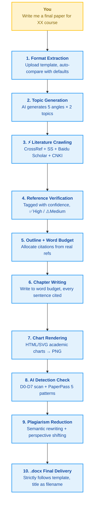

<h1 align="center">💧 WaterPaper.skill</h1>
<h3 align="center">WaterPaper · One Sentence, One Paper</h3>

<p align="center"><em>"Good enough is great. I just want it done, qualified, and submitted."</em></p>

<p align="center">
  
  
  
</p>

<p align="center">
  🌐 <a href="README.md">中文</a> · <a href="README_EN.md">English</a>
</p>

<p align="center">
  <a href="#why-you-need-this">Why You Need This</a> ·
  <a href="#quick-start">Quick Start</a> ·
  <a href="#literature-data-sources">Data Sources</a> ·
  <a href="#paper-structure-course-papers">Paper Structure</a> ·
  <a href="#chart-types">Chart Types</a> ·
  <a href="#faq">FAQ</a> ·
  <a href="#workflow">Workflow</a> ·
  <a href="#project-structure">Project Structure</a>
</p>

<p align="center">
  One sentence → topics → <strong>real references</strong> grabbed → <strong>standard formatting</strong> applied → <strong>AI detection</strong> lowered → <strong>plagiarism</strong> reduced → .docx delivered<br/>
  It's not about cutting corners — it's about automating the grunt work so you can spend time on what actually matters.
</p>

---

## Why You Need This

Finals week. N course papers stacked on your desk. The process is always the same:

> Brainstorm topics → search references → read papers → outline → hit the word count → tweak formatting → lower AI score → submit

WaterPaper.skill automates all of it:

| Step | Manual Approach | LLM Client | WaterPaper.skill |
|------|-----------------|-------------|-------------------|
| Topics | Struggle to come up with 1 | AI generates topics, no real ref support | One sentence → 5 angles × 2 topics = 10 choices |
| References | Crawl CNKI, Wanfang, copy-paste | ❌ Fabricates references — titles & authors look real but don't exist | Multi-source crawler: auto fetch, deduplicate, verify |
| Formatting | Adjust line by line against a template | Manual format description, no precise replication | Upload .docx template → auto-extract → strict replication |
| Charts | Draw in Excel, screenshot, paste | Cannot generate or crude output | HTML-rendered publication-quality SVG charts → auto-insert |
| AI Reduction | Manually rephrase formulaic sentences | No AI reduction capability | D0–D7 seven-dimension constraints + PaperPass 5-pattern scan + 9 rewriting techniques |
| Plagiarism Reduction | Rewrite duplicate passages by hand | No plagiarism reduction capability | Deep semantic rewriting + perspective shifting + citation merging |

> The fatal flaw of LLM clients: **they fabricate references** — titles, authors, and journals that look real but don't exist. WaterPaper.skill sources all references from actual CrossRef / Semantic Scholar / Baidu Scholar retrievals. Each entry is annotated with its source and verifiability status; unverifiable entries are discarded.

You only need to do two things: **state what you need** and **make choices**. The scripts handle the rest.

## Quick Start

Send the GitHub URL or the path to your local copy of this project to your AI coding assistant (Claude Code / Codex / Trae / Cursor, etc.) and say:

> "Install this skill for me: https://github.com/ThisIsLittleSky/WaterPaper.git"

The AI agent will handle the setup automatically.

Once installed, just say what you need:

> "Use this skill to write a final paper on mobile communication technology, 4000 words, use 模板.docx as the format template."
>
> "Help me reduce the AI detection score for my paper: [paper path], [plagiarism report.html (optional)]"

The AI will walk through the full pipeline: **get template → propose topics → crawl references → build outline → write body → generate charts → deliver .docx**

## Literature Data Sources

| Source | Access Method | Chinese Coverage | Reliability | Rate Limit |
|--------|---------------|------------------|-------------|------------|
| CrossRef | REST API (free) | Moderate | ✅ High | 50 req/s |
| Semantic Scholar | REST API (free) | Moderate | ✅ High | API-key controlled |
| Baidu Scholar | Web scraping | ✅ Good | ⚠️ Medium (needs verification) | — |
| CNKI | Web scraping | ✅ Best | ⚠️ Low (strict anti-scraping) | — |

> For Chinese-language papers, we recommend Baidu Scholar as the primary source, supplemented by CrossRef/Semantic Scholar for English references. CNKI has aggressive anti-scraping measures — failures are expected and won't block the overall pipeline.

## Paper Structure (Course Papers)

| Word Count | Chinese Refs | English Refs | Chapter Structure |
|------------|-------------|-------------|-------------------|
| 3000–4000 | 4–6 | 1–2 | Introduction + 2 body chapters + Conclusion |
| 4000–6000 | 5–7 | 2–3 | Introduction + 2–3 body chapters + Conclusion |
| 6000–8000 | 6–8 | 2–4 | Introduction + 3 body chapters + Conclusion |

Supported disciplines: Business & Management, Humanities & Social Sciences, Science & Engineering, Case Analysis.

## Chart Types

- Bar chart (category comparison)
- Line chart (trend visualization)
- Flowchart / Framework diagram (theoretical frameworks, research processes)
- Data table (multi-dimensional comparison)
- Pie chart / Donut chart (proportion display)

All charts are HTML/SVG-rendered at 2x DPR for high-definition output, with an academic color palette.

## FAQ

<details>
<summary><b>Q: Can it replicate the weird formatting in my school's template?</b></summary>

Yes. `analyze_template.py` parses the .docx file paragraph by paragraph, extracting font, size, bold, alignment, line spacing, spacing before/after, first-line indent, and page breaks for every element, producing a structured JSON. `generate_paper_docx.py` then strictly reproduces the formatting from that JSON.

If your template has formatting beyond the script's analysis scope (e.g., custom headers/footers, watermarks), you can manually edit `style_profile.json` to supplement.
</details>

<details>
<summary><b>Q: Will the paper be flagged as AI-generated by plagiarism checkers?</b></summary>

**WaterPaper.skill has two lines of defense, battle-tested on PaperPass:**

**First line: AI Reduction (D0–D7 seven-dimension constraints + PaperPass 5-pattern scan)**
- Integrates the thesis-optimizer project's 30+ AI pattern taxonomy and 3-tier vocabulary blacklist
- D0 Minimal intervention: in-sentence micro-adjustments, no wholesale AI-style rewrites
- D1 Sentence length distribution: actively creates short-long alternation, breaking AI's bell-curve sentence length pattern
- D2 Paragraph structure: 5 templates randomly rotated, adjacent paragraphs never share the same structure
- D3 Information density: high-density core paragraphs alternating with low-density transitions ("high-low-high" rhythm)
- D4 Connective word control: red high-risk words ("furthermore", "crucially", "in summary") deleted outright; yellow medium-risk words density-controlled
- D5 Terminology context: heavy tier enables terminology variants
- D6 Logical humanization: breaks AI's linear "problem → method → conclusion" logic, preserves exploratory meandering
- **D7 Parallelism kills**: CNKI/PaperPass are extremely sensitive to parallel structures — "first/second/third", "firstly/finally" are shattered, replaced with fragmented sentences and line-break segmentation
- After writing, `humanize_check.py` runs automatically (including parallelism detection); delivery is blocked until it passes

**Second line: Plagiarism Reduction (deep semantic rewriting)**
- Standard definition passages: reorganize word order, avoid textbook-style phrasing
- Literature review passages: categorize and merge citations, no literature laundry lists
- Method description passages: add "why this method was chosen" motivation
- Conclusion passages: replace generic summaries with specific findings
- Full terminology protection throughout (discipline-specific abbreviations, mathematical models, citation numbers are never touched)

<p align="center">
  
</p>

<p align="center"><em>From 68.14% down to 28.59%, meeting the 30% AI-score threshold required by most undergraduate course finals.<br/>We don't chase an extreme low score — just good enough, qualified, and submitted.</em></p>

<br/>

After receiving the final draft, we recommend reading through it once and adding your own perspectives and course-specific content. WaterPaper is a tool, not a ghostwriter.
</details>

## Workflow

<details>
<summary><b>Click to expand: Full 10-step workflow</b></summary>

<br/>



</details>

## Project Structure

<details>
<summary><b>Click to expand: Project directory structure</b></summary>

<br/>

```
WaterPaper/
├── SKILL.md                          # Main skill definition
├── requirements.txt                  # Python dependencies
│
├── prompts/                          # AI prompt templates
│   ├── format_extractor.md           #   Format extraction (.docx template & text description)
│   ├── topic_selector.md             #   5 angles × 2 topic generation
│   ├── outline_builder.md            #   Outline + word budget + reference allocation
│   ├── chapter_writer.md             #   Chapter-by-chapter writing + citation rules + anti-plagiarism constraints
│   ├── chart_designer.md             #   Academic HTML chart templates
│   ├── humanize_constraints.md       #   D0–D7 AI reduction writing constraints (incl. PaperPass cheat sheet)
│   ├── humanize_pass.md              #   Standalone AI reduction rewrite flow (36 keys + 9 techniques + 5-pattern scan)
│   ├── detection_pass.md             #   AI detection check (incl. PaperPass feedback-based iterative rewrite)
│   └── plagiarism_pass.md            #   Standalone plagiarism reduction rewrite flow
│
├── tools/                            # Python utility scripts
│   ├── analyze_template.py           #   DOCX template format analyzer
│   ├── literature_scraper.py         #   Multi-source literature crawler (4 data sources)
│   ├── render_html_chart.py          #   HTML → PNG renderer (Playwright)
│   ├── count_words.py                #   Mixed Chinese-English word counter
│   ├── generate_paper_docx.py        #   Markdown → DOCX (python-docx)
│   └── humanize_check.py             #   AI reduction verifier (3-tier vocabulary report + density/parallelism detection)
│
└── references/                       # Reference specifications
    ├── course_paper_structure.md     #   4 discipline-specific paper structure templates
    ├── default_format.md             #   GB/T 7714 default formatting spec
    ├── detection_principles.md       #   Platform-specific AI detection principle analysis
    ├── humanize_platforms.md         #   Platform-specific AI reduction strategies (incl. CNKI v3.0)
    ├── humanize_matrix_template.md   #   humanize_matrix.md template
    ├── paperpass_patterns.md         #   PaperPass 5 fatal patterns + counter-examples + score data
    ├── rewrite_methods.md            #   9 AI reduction rewriting techniques quick reference
    ├── ai_pattern_taxonomy.md        #   30+ AI pattern taxonomy (S01–S10 incl. PaperPass specifics)
    ├── ai_vocabulary_blacklist.md    #   3-tier vocabulary blacklist
    └── term_whitelist.md             #   Terminology protection whitelist
```

</details>

## License

MIT

---

<p align="center">
  <sub>WaterPaper isn't really about cutting corners. It's about handing the grunt work to scripts so you can spend your time on what truly matters.</sub>
</p>

<p align="center">
  <a href="https://github.com/ThisIsLittleSky/WaterPaper/issues">Issues</a> ·
  <a href="https://github.com/ThisIsLittleSky/WaterPaper/pulls">Pull Requests</a>
</p>

<p align="center">
  <sub>Issues and Pull Requests are welcome!</sub>
</p>
